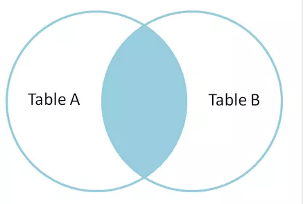
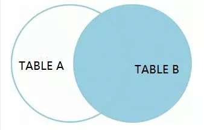

####################################################################################################
**语法构造器**
####################################################################################################

******************************************************************************************
**SELECT**
******************************************************************************************

**说明：** 在（ **ItemModel/ListModel** ）查询时指定查询的字段使用 ``->select($columns)`` 函数即可。

**用法：** select($columns)

**参数：** $columns: string | array

**例1：** 底层实现最终都会转化为数组形式。

.. code-block:: php
    :linenos:
    :emphasize-lines: 3,7-11

    <?php
        ItemModel::make('table_name')
            ->select('id, name, age')
            ->execute();

        ListModel::make('table_name')
            ->select([
                id,
                name,
                age
            ])
            ->execute();
    ?>
            
******************************************************************************************
**FROM**
******************************************************************************************

**说明：** 在所有 **Model** 类中的 ``::make($table)`` $table 就是数据库表名, 并且默认不写数据库表前缀 ``t_``, 系统内部还会自动为这个表生成一个别名 ``t`` , 以便于需要使用这个表时直接使用别名即可。

**用法：** make($table)

**参数：** $table: string

**例1：** 

.. code-block:: php
    :linenos:

    <?php
        ItemModel::make('user')->execute(); // 数据库表名是: `t_user`
    ?>

******************************************************************************************
**WHERE**
******************************************************************************************

**说明：** 在 **Model** 类中只有 ``InsertModel`` 没有该条件。

**用法：** 本章节中基本使用方法/条件控制_ 有各种形式的封装。

.. _条件控制: ./guide.html#id11

**例1：** 

.. code-block:: php
    :linenos:

    <?php

        ->addColumn('id', '10')
        ->addColumnsCondition([
                'id' => ['in', [1, 2, 3]],
                'name' => 'jollysone'
            ])
        ->addStrCondition('id = 10')

        ->addInCondition('id', ['in', [1, 2, 3]])

    ?>

******************************************************************************************
**JOIN**
******************************************************************************************

MySQL官方只提供了三种join方式。

1. **内连接** (inner join)

2. **左连接** (left join)

3. **右连接** (right join)

不支持其他的连接关键字。直接写 ``join`` 会默认选择内连接方式。

================================================================================
**INNER JOIN**
================================================================================

**说明：** 数据库使用 ``join`` 其实默认就是 ``inner join`` 。它也被称为一个等值连接。通过结合基于联接谓词两个表(表1和表2)列值创建一个新的结果表。查询比较表1中的每一行与表2中的每一行，找到所有满足联接谓词的行。 当联接谓词被满足时，对于每个匹配的一对A和B的列值被组合成一个结果行。

**用法：** join($type, $table, $as, $on = '', $params = array())

**参数：**

    $type: enum    , 连接方式 ``inner join`` | ``left join`` | ``right join'``

    $table: string    , 表名,默认不带前缀

    $as：string     , 此表的别名

    $on: string     , 连接条件

    $params：array      , 连接条件中的 PDO 传参

**例1：** 此函数可以自定义构造任何一种连接方式。

.. code-block:: php
    :linenos:
    :emphasize-lines: 4,8-11

    <?php

        ItemModel::make('user')
            ->join('inner join', 'logs', 'l', 't.id = l.uid')
            ->execute();

        ItemModel::make('user')
            ->join('left join', 'logs', 'l', 't.id = l.uid and t.phone = ? and l.time = ?', [
                '13011118899',
                '2019-08-08 12:34:56'
            ])
            ->execute();

    ?>

================================================================================
**LEFT JOIN**
================================================================================

**说明：** 左连接是得到A表中去除B表内容的剩下的部分，也就是A表独有的一部分。可以看做是在左外连接的结果中将双方共有的部分去掉得到的。

.. image:: ../_static/左连接.png
    :height: 200px
    :alt: 左连接
    :align: center

**用法：** leftJoin($table, $as, $on = '', $params = array())

**参数：**

    $table: string    , 表名,默认不带前缀

    $as：string     , 此表的别名

    $on: string     , 连接条件

    $params：array      , 连接条件中的 PDO 传参

**例1：**

.. code-block:: php
    :linenos:
    :emphasize-lines: 4,8-11

    <?php

        ItemModel::make('user')
            ->leftJoin('logs', 'l', 't.id = l.uid')
            ->execute();

        ItemModel::make('user')
            ->leftJoin('logs', 'l', 't.id = l.uid and t.phone = ? and l.time = ?', [
                '13011118899',
                '2019-08-08 12:34:56'
            ])
            ->execute();

    ?>

================================================================================
**RIGHT JOIN**
================================================================================

**说明：** 同理，右连接是在右外连接的结果中得到B表独有的那一部分。

**用法：** rightJoin($table, $as, $on = '', $params = array())

**参数：**

    $table: string    , 表名,默认不带前缀

    $as：string     , 此表的别名

    $on: string     , 连接条件

    $params：array      , 连接条件中的 PDO 传参

**例1：**

.. code-block:: php
    :linenos:
    :emphasize-lines: 4,8-11

    <?php

        ItemModel::make('user')
            ->rightJoin('logs', 'l', 't.id = l.uid')
            ->execute();

        ItemModel::make('user')
            ->rightJoin('logs', 'l', 't.id = l.uid and t.phone = ? and l.time = ?', [
                '13011118899',
                '2019-08-08 12:34:56'
            ])
            ->execute();

    ?>

******************************************************************************************
**GROUP BY**
******************************************************************************************

**说明：** 按条件分组查询, 可以多次分组(分组后再分组), 一般和聚合函数 ``count()`` 、 ``sum()`` 、 ``avg()`` ``...`` 搭配使用才有意义。

**用法：** group($columns)

**参数：** $columns: string | array

**例1：** 底层实现最终都会转化为数组形式。

.. code-block:: php
    :linenos:
    :emphasize-lines: 3,7,11

    <?php
        ItemModel::make('user')
            ->group('id')
            ->execute();

        ItemModel::make('user')
            ->group('id, name')
            ->execute();

        ItemModel::make('user')
            ->group(['id', 'name'])
            ->execute();
    
    ?>
    

******************************************************************************************
**ORDER BY**
******************************************************************************************

**说明：** 按某个条件进行排序, 可以多个条件, 依次从左到右排序。

**用法：** order($columns)

**参数：** $columns: string

**例1：** ``ASC`` 升序, ``DESC`` 降序。（不区分大小写）

.. code-block:: php
    :linenos:
    :emphasize-lines: 3,7

    <?php
        ItemModel::make('user')
            ->order('id desc')
            ->execute();

        ItemModel::make('user')
            ->order('id desc, age asc')
            ->execute();
    ?>

******************************************************************************************
**HAVING**
******************************************************************************************

**说明：** 一般用于 ``GROUP BY`` 分组后的条件查询, 其他情况视条件而用。

**用法：** having($condition, $params = [])

**参数：** $condition: string , $params: array

**例1：** 底层实现是字符串拼接或PDO传参形式。

.. code-block:: php
    :linenos:
    :emphasize-lines: 4,9-12

    <?php
        ItemModel::make('user')
            ->group('id')
            ->having("name = 'jollysone' and age = 24")
            ->execute();

        ItemModel::make('user')
            ->group('id, name')
            ->having('name = ? and age = ?',[
                'jollysone',
                24
            ])
            ->execute();

    ?>

******************************************************************************************
**LIMIT**
******************************************************************************************

尚未整理

******************************************************************************************
**OFFSET**
******************************************************************************************

尚未整理

统计总数

$count = CDbCommand::count($CDbCondition, '*');
构造IN条件

DbUtil::buildInCondition($dbField, $idArray);
数组方式写查询条件

addColumnsCondition([
    'field1' => 'value1',
    'field2' => ['>=', 'value2'],
    'field3' => ['<=', 'value3'],
    'field4' => ['in', array()]
]);
上级公司

// 1.只对上级公司有效
// 2.查询逻辑：com_id in (当前公司及其子公司id)
// 3.支持筛选：传__com_id，筛选__com_id中的公司 
new ManagerComidCondition()
用户权限

// 根据当前会话的权限类型，算出uid的取值范围，作为in条件
new UserAuthConditon(AuthType::getAuthType(AuthManager::AUTH_HOUSEHOLD_VIEW), 'uid')
in条件

new EqualInCondition($http_field, $db_field)
=条件

new EqualCondition($http_field, $db_field)
定值条件

// $value是数值，=查询
// $value是数组，in查询
new DefaultValueCondition($db_field, $value)
模糊查询

// 默认匹配%$http_field%
// $db_field是一个字段，单字段like查询
// $db_field是字段数组，多字段or like查询
new LikeCondition($http_field, $db_field, $lr)
数字范围

// $db_field >= $http_start_field AND $db_field <= $http_end_field
// $data_type 传 int 或 decimal
new NumberRangeCondition($http_start_field, $http_end_field, $db_field, $data_type)
日期范围

// $db_field >= strtotime($http_start_field) 
// AND $db_field <= strtotime($http_end_field) + 86400
new DateRangeCondition($http_start_field, $http_end_field, $db_field)

切换数据库

//访问全局
\CC::app()->db->addConnectListener(new ZhifaServer2ConnectListenerInterface());

//某条查询
$config = [
    'dsn' => 'mysql:host=localhost;dbname=fhj', 
    'username' => 'root', 
    'password' => '123456'
];
InsertModel::make($table)
    ->setDbConnectListener(new SimpleConnectListener($config)) 
    ->addData($item) 
    ->execute();
插入记录不带com_id

InsertModel::make($table)
    ->addNoGlobalInsertBeforeInterceptors([
        'CC\action\module\common\db\sglobal\ComInsertInterceptors'
    ])
    ->addData($item) 
    ->execute();
去掉拦截器默认加上的com_id等于当前公司id的条件

new NoComidCondition()
