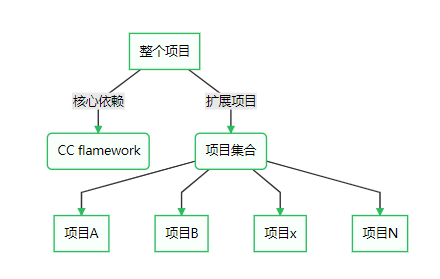

####################################################################################################
**架构总览**
####################################################################################################

.. code-block:: 

    app/protected/module/ 存储各模块接口

    接口访问路径：/权限/模块/子模块/文件  

    仅管理员：/admin/file/manage/list
    开放访问：/api/file/manage/list

    ├─module        应用模块
    │  ├─file          文件模块
    │  │  ├─manage    子模块
    │  │  │    ├─...
    │  │  │    └─FileManageListAction.php
    │  │  └─...
    │  └─...

    命名：FileManageListAction.php / FileManageListAdminAction.php
    需要访问 /admin/file/manage/list

    如需要开放API接口，需要命名 FileManageListApiAction.php

想要识别到控制器必须放在子模块下，并不支持子文件夹。也就是 命名只能 FileManageListaddApiAction.php 不能叫 FileManageListAddApiAction.php
想要索引到 只能通过路由的方式

