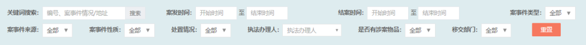
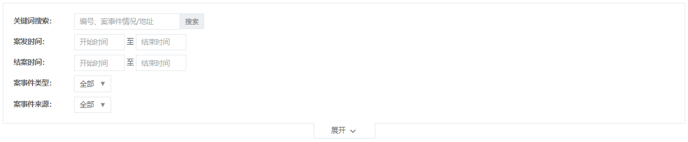

####################################################################################################
**过滤器**
####################################################################################################

******************************************************************************************
**基本用法**
******************************************************************************************

过滤器视图通常需要跟服务端搭配使用。视图中渲染的各种 ``过滤器组件`` , 详见本章其它小节。

.. note:: 
    **重要的三步：**

    1. 在控制器中实现 ``ITableViewCreator`` 的 ``createListFilters()`` 方法。

    2. 在 ``createListFilters()`` 方法中实例化各种组件, 并且以 ``数组形式`` 返回。

    3. 在同级目录的 ``view`` 文件中渲染视图内容。

**控制器写法：**

.. code-block:: php
    :linenos:
    :emphasize-lines: 2,6-10

    <?php
        class ExampleManageIndexAction extends ListAction implements ITableViewCreator
        {
            ...
            
            public function createListFilters()
            {
                $filters[] = new TimeRangeFilter('assign_time', '指派时间', 'simple');
                return $filters;
            }

            ...
        }
    ?>

**视图文件写法：**

.. code-block:: php
    :linenos:
    :emphasize-lines: 6

    <?php
        use CC\util\common\widget\panel\ListSearchPanel;
        use CC\util\common\widget\widget\FilterWidget;
        use CC\util\common\widget\widget\WidgetBuilder;

        echo WidgetBuilder::build(new FilterWidget($this), ListSearchPanel::instance());
    ?>

******************************************************************************************
**过滤器样式**
******************************************************************************************

:方法：: **new FilterWidget(** ITableViewCreator $tableViewBuilder, $options = array() **)**

:参数：:

    - **$tableViewBuilder：** ``必填`` 表格对象，

    - **$options：** 配置项：

        **1. id：** 默认 `'id' => ''` ，用于标记表单的 `id`，不标记默认自动随机号码；

        **2. show_export_btn：** 默认 `'show_export_btn' => false` ，可标记是否在过滤器最后显示导出按钮；
    
        **3. style：** 默认 `'style' => 'vertical'` ，默认显示垂直排列风格，可定义水平排列风格（ `'style' => 'horizontal'` ）；

        **4. filterBuildBeforeHandler：** 默认 `'filterBuildBeforeHandler' => null` ，过滤器 `BeforeHandler` ， ``尚未验证用法`` ；

        **5. is_asyn：** 默认 `'is_asyn' => false` ， 是否异步， ``尚未验证用法`` ；

        **6. choose_obj：** 默认 `'choose_obj' => ''` ， JS对象 要求必须要有 refreshCallBack 这个方法， ``尚未验证用法`` ；

        **7. action：** 默认 `'action' => ''` ，可指定表单的 `action` ，一般会配合提交按钮才行；

   
.. Tip:: 默认样式是垂直显示方式（ **['style' => 'vertical']** ）。

================================================================================
**水平排列风格**
================================================================================

:说明：: 水平排列风格将会 **从左到右依次排列** ，元素放不下的情况会自动换到下一行显示。

:代码块：:

.. code-block:: php
    :linenos:
    :emphasize-lines: 6

    <?php
        use CC\util\common\widget\panel\ListSearchPanel;
        use CC\util\common\widget\widget\FilterWidget;
        use CC\util\common\widget\widget\WidgetBuilder;

        echo WidgetBuilder::build(new FilterWidget($this, ['style' => 'horizontal']), ListSearchPanel::instance());
    ?>

:效果图：:

    图：水平排列风格效果图

================================================================================
**垂直排列风格**
================================================================================

:说明：: 垂直排列风格 **一行只会显示一个** ，多个依次换行显示，默认超过 ``5`` 个之后自动收缩。

:代码块：:

.. code-block:: php
    :linenos:
    :emphasize-lines: 6

    <?php
        use CC\util\common\widget\panel\ListSearchPanel;
        use CC\util\common\widget\widget\FilterWidget;
        use CC\util\common\widget\widget\WidgetBuilder;

        echo WidgetBuilder::build(new FilterWidget($this, ['style' => 'vertical']), ListSearchPanel::instance());
    ?>

:效果图：:

    图：垂直排列风格效果图

******************************************************************************************
**过滤器组件**
******************************************************************************************

================================================================================
**文本输入框**
================================================================================

.. code-block:: php
    :linenos:

    <?php
        $filters[] = new InputFilter($name, $label, $placeholder, $is_show_submit, [
            'is_need_setting' => false,
            'is_need_reset' => true,
        ]);
    ?>

================================================================================
**单选框 & 复选框**
================================================================================

:方法：: **new SelectFilter(** $name, $label, $data_arr, $style = '', $default_option = [] **)**

:参数：:
    - **$name：** ``必填`` 字段名，

    - **$label：** ``必填`` 标签显示名称，

    - **$data_arr：** ``必填`` 选择框数据（一维数组），

    - **$style：** 选择框样式（ **'', 'multi', 'drop-down', 'drop-pop'** ）默认第一个，

    - **$default_option：** 额外配置默认选择的一项 **['value' => 'showText']**，默认不选择。

:可扩展方法：:

    - **setIsMultiple(bool)：**  设置是否多选，只适用于 ``$style：'' | 'multi'`` 的场景。

    .. code-block:: php
        :linenos:

        <?php
            $filters[] = (new SelectFilter($name, $label, $data_arr))->setIsMultiple(bool);
        ?>

:使用例子：:

    **例1：** 配置 $style = 'multi' 或者 $style = ''，支持单选、多选双模式。

    .. figure:: ../_static/view_filter_select_1.png
        :align: center

        图：单选、多选双模式效果图

    .. Tip:: 
        需要保持这个样式但是只需要单选功能，可配置扩展方法（ **setIsMultiple(false)** ）设置单选;

    **例2：** 配置 $style = 'drop-down' ，单选，不自动跳转。

    .. figure:: ../_static/view_filter_select_2.png
        :align: center

        图：单选不自动跳转效果图

    **例3：** 配置 $style = 'drop-pop' ，单选，自动跳转。

    .. figure:: ../_static/view_filter_select_3.png
        :align: center

        图：单选自动跳转效果图

================================================================================
**时间范围**
================================================================================

:方法：: **new TimeRangeFilter(** $name, $label, $style = '', $ranges = null, $option = [] **)**

:参数：:

    - **$name：** ``必填`` 字段名，

    - **$label：** ``必填`` 标签显示名称，

    - **$style：** 选择框样式（ **'', 'simple'** ）默认第一个，
    
    - **$ranges：** 默认 **['total', 'today', 'this_week', 'this_month']**，

    - **$option：** 额外配置默认选择项 **['default_choose' => 'total']**，默认不选择。

.. note::
    **$ranges** 可配置的可选项。
    
        **1.** 'total'      全部,

        **2.** 'today'      今日,

        **3.** 'this_week'      本周,

        **4.** 'this_month'     本月,

        **5.** 'yesterday'      昨日,

        **6.** 'last_week'      上周,

        **7.** 'last_month'     上一月,

:扩展方法：:  

    - **setPlaceholders($placeholders)** 设置提示语。

    .. code-block:: php
        :linenos:

        <?php
            $filters[] = (new TimeRangeFilter($name, $label))->setPlaceholders(array);

            $filters[] = (new TimeRangeFilter($name, $label))
                ->setPlaceholders([
                    'start' => '开始时间',
                    'end' => '结束时间'
                ]);
        ?>

:使用例子：:

    **例1：** 配置 $style = '' 或者 不配置，默认的显示。

    .. figure:: ../_static/view_filter_time_1.png
        :align: center

        图：默认显示效果图

    **例2：** 配置 $style = 'simple' ，将会隐藏样式前面的类型。

    .. figure:: ../_static/view_filter_time_2.png
        :align: center

        图：简单时间范围过滤器效果图

    .. Tip:: 
        后台接收的参数可能有： ``类型`` ``开始时间`` ``结束时间``

        1. 类型字段名：「字段名」_type，值：参考上文的配置可选项；
        2. 开始时间字段名：「字段名」_start，值：选择的开始时间（2019-08-06）；
        3. 结束时间字段名：「字段名」_end，值：选择的结束时间（2019-08-07）；
        
        如：``submit_time_type=this_week`` ``submit_time_start=2019-08-06`` ``submit_time_end=2019-08-07`` 

================================================================================
**时间点**
================================================================================

:方法：: **new SimpleTimeFilter(** $name, $label, $placeholder, $style = '', $end_min = false, $end_max = false **)**

:参数：: 

    - **$name：** ``必填`` 字段名，

    - **$label：** ``必填`` 标签显示名称，

    - **$placeholder：**  ``必填`` 描述输入字段预期值的提示信息，

    - **$style：**  配置该组件的 class 属性，选择月份 **'date-month'** 选择年份 **'date-year'** 默认选择日期，

    - **$end_min：** 可选择的最早时间是否从当前开始，

    - **$end_max：** 可选择的最晚时间是否从当前结束。

:扩展方法：:  

    - 暂无 **set** 方法。

:使用例子：:

    **例1：** 配置 $style = '' 或者 不配置，日期的选择。

    .. figure:: ../_static/view_filter_simple_time_1.png
        :align: center

        图：日期选择效果图

    **例2：** 配置 $style = 'date-month' ，可按月份选择。

    .. figure:: ../_static/view_filter_simple_time_2.png
        :align: center

        图：月份选择效果图

    **例3：** 配置 $style = 'date-year' ，可按年份选择。

    .. figure:: ../_static/view_filter_simple_time_3.png
        :align: center

        图：年份选择效果图

================================================================================
**值域范围**
================================================================================

:方法：: **new RangeInputFilter(** $min_name, $max_name, $label, $unit='', $name='', $is_show_submit = false **)**

:参数：: 

    - **$min_name：** ``必填`` 左值字段名，

    - **$max_name：** ``必填`` 右值字段名，

    - **$label：**  ``必填`` 标签显示名称，

    - **$unit：** 显示在组件框后面的内容，可作说明提示，

    - **$name：** 定义 `class` 属性，默认是有一个前缀 `sure_` ，

    - **$is_show_submit：** 是否显示 **确定** 按钮。

:扩展方法：:  

    - 暂无 **set** 方法。

:使用例子：:

    **例1：** 默认配置。

    .. figure:: ../_static/view_filter_range_input_1.png
        :align: center

        图：默认值域范围效果图

    **例2：** 额外配置 ``$uint = '输入请从12开始'`` 参数。

    .. figure:: ../_static/view_filter_range_input_2.png
        :align: center

        图：带说明值域范围效果图

    **例3：** 额外配置 ``$is_show_submit = true`` 参数。在点击输入框时/输入时显示 ``确定`` 按钮。

    .. figure:: ../_static/view_filter_range_input_3.png
        :align: center

        图：显示确定按钮效果图

================================================================================
**树结构**
================================================================================

:方法：: **new TreeFilter(** $name, $label, $data_arr, $options = array() **)**

:参数：: 

    - **$name：** ``必填`` 字段名，

    - **$label：** ``必填`` 标签显示名称，

    - **$data_arr：** ``必填`` 树结构数据，

        .. code-block::

            样例结构：
                array (
                    "id":"1",
                    "name":"xx",
                    "nodeId":"0",
                    "is_node":true,
                    "is_check":false,
                )

    - **$options：** 配置项：

        **1.** **'only_child'** => true, 是否只能获取子节点，默认配置是 **true** ；

        **2.** **'tips'** => '', 输入框提示语， 默认配置显示参数 **$label** 值；

        **3.** **'auto_submit'** => true, 是否在选择完成后自动提交请求，默认配置是 **false** ；

        **4.** **'sel_data_type'** => '', 选中数据类型, 'merge' 合并子节点 ``未验证用法`` ；

        **5.** **'sel_data_node_separate'** => false, 选中数据区分阶段 ``未验证用法`` ；

        **6.** **'is_multi'** => 'true', 是否多选，传字符串 'true' 或 'false' ，不配置默认是 'true'；

        **7.** **'is_has_button'** => false, 是否在选择框底部显示 ``清空`` 和 ``确定`` 按钮；

        **8.** **'lazyLoad'** => false, 是否开启异步加载，用于数据比较多的时候，默认配置是 **false** ；

        **9.** **'lazyLoadUrl'** => '', 异步加载url，需要开启异步加载生效，默认配置是 **空** ；

        **10.** **'has_search'** => true, 是否显示搜索框，默认配置是 **true** ；

        **11.** **'like_search'** => false, 以为是个配置是否模糊搜索，看了代码没啥用；

        **12.** **'position'** => 'absolute' ，树形框的位置，一般会配置 **'fixed'** 。

        .. Tip:: 
            1. 配置 ``'is_has_button' = true`` 后一般不配置自动提交请求（ **auto_submit** ），默认配置是 **false** ；
            2. 数据量庞大时可配置异步加载。

:扩展方法：:  

    - 暂无 **set** 方法。

:使用例子：:

    **例1：** 常规配置，需配置 ``'position' => 'fixed'`` 让显示框置于顶层。

        .. code-block:: php
            :linenos:

            <?php
                $filters[] = new TreeFilter($name, $label, $data_arr, [
                    'position' => 'fixed'
                ]);
            ?>

        .. figure:: ../_static/view_filter_tree_1.png
            :align: center

            图：常规树形结构效果图

    
    **例2：** 常规配置，需配置 ``'is_has_button' => true`` 在选择框底部显示 ``清空`` 和 ``确定`` 按钮。

        .. code-block:: php
            :linenos:

            <?php
                $filters[] = new TreeFilter($name, $label, $data_arr, [
                    'is_has_button' => true
                ]);
            ?>

        .. figure:: ../_static/view_filter_tree_2.png
            :align: center

            图：选择框底部显示按钮效果图

        .. note:: 配置底部按钮后树结构会全部收缩起来。

******************************************************************************************
**自定义过滤器**
******************************************************************************************

.. note:: 
    **重要的两步：**

    1. 新建控制器并继承 ``FilterAbs`` 控制器, 重写 ``onCreateFilter(\CRequest $request)`` 方法。

    2. 在控制器同级目录的 ``view`` 目录中新建 **同名视图文件** （首字母小写）。

**控制器写法：**

.. code-block:: php
    :linenos:
    :emphasize-lines: 2,6-9

    <?php
        class ExampleFilter extends FilterAbs
        {
            ...
            
            public function onCreateFilter(\CRequest $request)
            {
                return [
                    'name' => '在数组里传递给视图数据'
                ];
            }

            ...
        }
    ?>

**视图文件写法：** 视图内容自由发挥。

.. code-block:: 
    
    控制器与视图存放目录：

    ├─view
    │  └─exampleFilter.php    视图文件（首字母小写）
    ├─ExampleFilter.php    控制器
    │  
   
    

